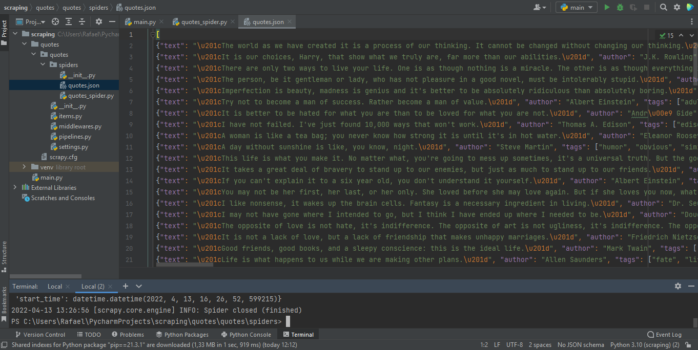
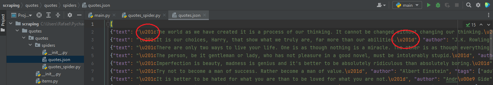
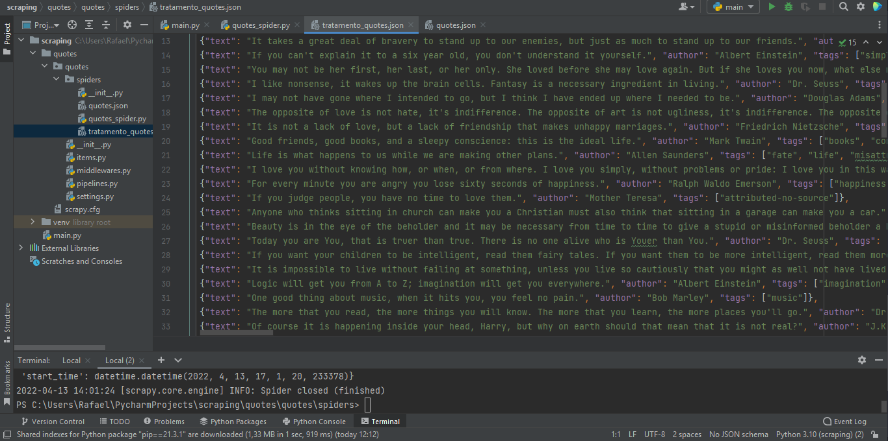

# Praticando **_WEBSCRAPING_**

### _Neste projeto estou ealizando a **Extração** de dados do site [Quotes to Scrape](https://quotes.toscrape.com/page), convertendo-os em informação estruturada para posterior análise_

 

**Nas páginas do site encontramos:**  
- Citações de grandes nomes da história 
_(Albert Einstein, J.K Roulling, Jane Austen, Thomas Edison entre outros)_
- Biografias   

Foram coletadas as _**frases**_, os _**autores**_ de cada frase, e as _**tags**_ relacionadas  
 
___
 

Na classe _QuotesSpyder_ eu dou um nome ao projeto, e criei uma outra variável que recebe a url chamada de _stars_urls_
 
 

    class QuotesSpider(scrapy.Spider):
        name = "quotes"
        start_urls = [ "http://quotes.toscrape.com/page/1/" ]

 

Dentro da classe _QuotesSpider_ eu criei o método que faz o _scrapy_ das informações que determinei para esta solução com uma laço de repetição:

- Texto, Autor da Frase e as tags Relacionadas de _**todas as páginas do site**_ graças ao _callback_ 

 

     def parse(self, response):
         for quote in response.css('div.quote'):
             yield {
                'text': quote.css('span.text::text').get(),
                'author': quote.css('small.author::text').get(),
                'tags': quote.css('div.tags a.tag::text').getall()
             }
         next_page = response.css('li.next a::attr(href)').get()
         if next_page is not None:
             yield response.follow(next_page, callback=self.parse)

### Executando o código
_Aqui estou rodando o código **quotes**, nome esse que foi atribuído ao projeto na variável _**name**_ lá no começo do código. E ao mesmo tempo estou dando o comando para criar um novo arquivo .json para consumo e tratamento desses dados em sequência_

    scrapy crawl quotes -O quotes.json

O arquivo .json ficou da seguinte forma: 
 (_**clique**_ na imagem para uma melhor resolução) 
  

Após a extração dos dados, acrescentei no código um método de tratamento simples em todas as linhas apenas do arquivo .json, retirando as informações circuladas em vermelho que não seriam úteis para uma visualização limpa dos dados
 (_**clique**_ na imagem para uma melhor resolução) 

  

 
 

    def clean_text(text):
    text = text.strip(u'\u201c')
    text = text.strip(u'\u201d')
    return text

    class QuotesSpider(scrapy.Spider):
        name = "quotes"
        start_urls = [ "http://quotes.toscrape.com/page/1/" ]

         def parse(self, response):
            for quote in response.css('div.quote'):
                yield {
                     'text': clean_text(quote.css('span.text::text').get()),
                     'author': quote.css('small.author::text').get(),
                     'tags': quote.css('div.tags a.tag::text').getall()}
            next_page = response.css('li.next a::attr(href)').get()
             if next_page is not None:
                yield response.follow(next_page, callback=self.parse)

_________________
 
Arquivo .json tratado:
 (_**clique**_ na imagem para uma melhor resolução) 
 

  

 
 

Dessa forma finalizo o meu _WEBSCRAPING_ onde coletei dados específicos de todas as páginas de um site, limpei, tranformei em um arquivo de fácil leitura, e os transformei para consumo e melhor visualização.

Estou praticando, há muito campo para melhora, porém estou satisfeito por realizei o que me propus fazer

Um abraço, 

Rafael Cicaroli
___
 
Quer falar comigo?

  

    

 

